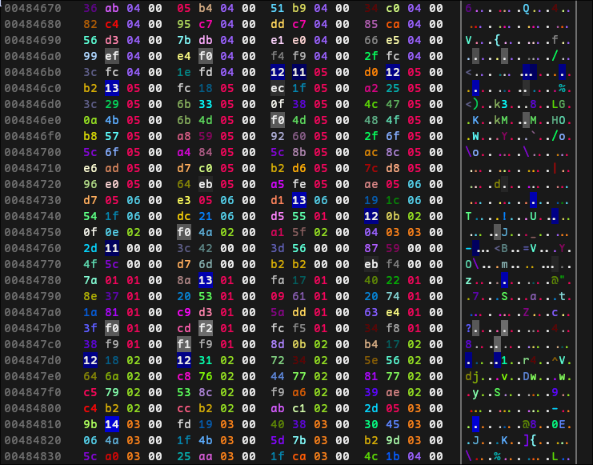

<p align="center">
  
  <div align="center">A modern alternative to `xxd` and `hexdump`</div>
</p>



## Example usage
```sh
hexxy /path/to/file.bin
# dont output with color
hexxy --no-color /path/to/file.bin
# dump multiple files
hexxy file1 file2 file3
# read from stdin
cat mybinary | hexxy
# display offset in Decimal format
hexxy -td file.bin
# display offset in Octal format
hexxy -to file.bin
```
